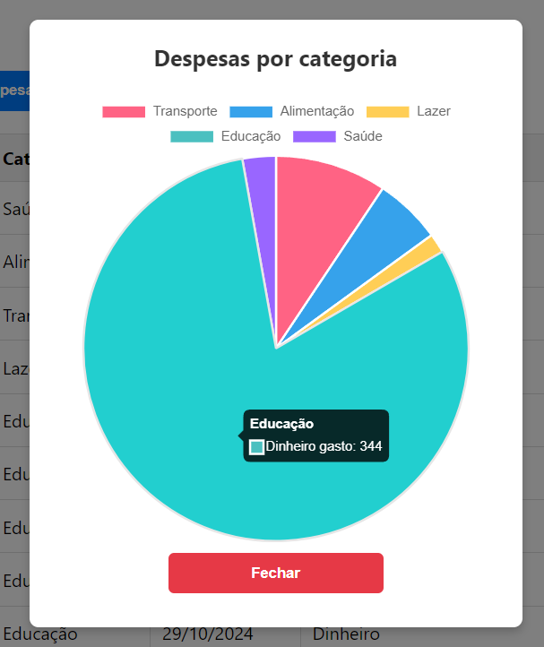

# Despesas

## Como Executar a Aplicação

### Passos

1. **Clonar o Repositório**
     ```
     git clone https://github.com/dmcs19/Despesas.git
     cd Despesas
     ```

2. **Configurar a Base de Dados**
   - Crie uma base de dados SQLite.
   - Altere as configurações de conexão no arquivo `appsettings.json` do backend para refletir as credenciais da sua base de dados.

3. **Executar o Backend**
   - Navegue até a pasta do backend:
     ```
     cd DespesasApi/DespesasApi
     ```
   - Restaure as dependências do projeto:
     ```
     dotnet restore
     ```
   - Inicie o servidor do backend:
     ```
     dotnet run
     ```
   - O backend estará disponível em `http://localhost:5093`.

4. **Executar o Frontend**
   - Navegue até a pasta do frontend:
     ```
     cd DespesasClient/despesas-frontend
     ```
   - Instale as dependências do frontend:
     ```
     npm install
     ```
   - Inicie o servidor de desenvolvimento do frontend:
     ```
     npm start
     ```
   - O frontend estará disponível em `http://localhost:3000`.
   - 
---

### Prints da Aplicação

Aqui estão algumas capturas de tela que demonstram a aplicação em funcionamento:

- **Tela de Login:**

  

- **Tela do Dashboard:**

  

- **Tela de Criação de Despesa:**

  

- **Gráfico de Despesas:**

  
